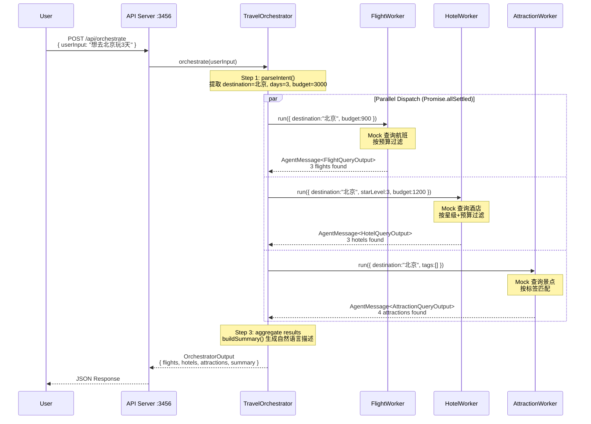

# ADR-003: Multi-Agent 骨架采用 Orchestrator-Worker 模式

## 状态

Accepted (2026-05-27)

## 场景

项目当前通过 WorkflowEngine（`shared/workflow-engine.ts`）实现了三个顺序工作流：ItineraryWorkflow（8 步）、PerceptionWorkflow（5 步）、CompanionMatchingWorkflow（5 步）。但 WorkflowEngine 有以下局限：

1. **纯顺序执行** — 所有 Step 串行执行，无法并行调用多个独立服务。例如行程规划需要同时查询航班、酒店和景点，顺序执行会浪费时间。
2. **紧耦合** — Step 之间通过共享的 `TContext` 对象传递数据，Step 之间隐式依赖，难以独立测试和替换。
3. **无 Agent 间消息传递** — 没有标准的 AgentMessage 协议，不同 Agent/Worker 之间无法解耦通信。
4. **无并行容错** — 一个 Step 失败整个 Workflow 失败，无法像 `Promise.allSettled` 那样部分成功。

随着项目引入更多 AI Agent（旅行管家、行程规划、旅伴匹配），需要一种支持并行调度、消息传递、独立容错的 Multi-Agent 架构。

## 决策

我们采用 **Orchestrator-Worker 模式** 实现 Multi-Agent 骨架：

| 组件 | 职责 | 实现 |
|------|------|------|
| **AgentMessage** | Agent 间通信标准协议 | `shared/multi-agent/types.ts` — 包含 id、type（task/result/error）、from/to、payload、correlationId |
| **BaseWorker** | Worker 抽象基类 | `shared/multi-agent/base-worker.ts` — 内置日志、错误处理，Worker 只需实现 `execute()` |
| **TravelOrchestrator** | 接收用户输入 → 拆解子任务 → 并行分发 → 汇总 | `shared/multi-agent/orchestrator.ts` |
| **FlightWorker** | 机票查询（mock） | 返回目的地航班列表，按预算过滤 |
| **HotelWorker** | 酒店查询（mock） | 返回目的地酒店列表，按星级和预算过滤 |
| **AttractionWorker** | 景点查询（mock） | 返回目的地景点列表，按标签匹配 |

### 核心设计决策

**1. `Promise.allSettled` 而非 `Promise.all`**

每个 Worker 独立容错。FlightWorker 失败不影响 HotelWorker 和 AttractionWorker 的结果返回。最终汇总时收集所有 errors 数组，部分失败不影响整体响应。

```typescript
const [flightSettled, hotelSettled, attractionSettled] = await Promise.allSettled([
  this.flightWorker.run(flightInput, traceId),
  this.hotelWorker.run(hotelInput, traceId),
  this.attractionWorker.run(attractionInput, traceId)
])
```

**2. 结构化日志贯穿全链路**

复用 `shared/utils/logger.ts` 的 `createLogger(traceId)` 能力。每次编排生成唯一 traceId，ENTRY → STEP（parse → dispatch → 3 x worker）→ EXIT 全链路可追踪。

**3. Mock Worker 可替换为真实实现**

每个 Worker 继承 `BaseWorker<TInput, TOutput>`，只需实现 `execute()` 方法。后续可将 FlightWorker 的 mock 替换为真实机票 API 调用（如通过 `adapters/supabase-adapter` 的 `flight.query` 服务），接口契约不变。

**4. 输入/输出格式强类型化**

每个 Worker 有明确的 TypeScript 接口定义：

```
FlightWorker:  FlightQueryInput  → FlightQueryOutput
HotelWorker:   HotelQueryInput   → HotelQueryOutput
AttractionWorker: AttractionQueryInput → AttractionQueryOutput
```

### Mermaid 时序图



## 后果

### 正面

- **并行执行**：3 个 Worker 并行查询，总耗时 ≈ max(单个 Worker 耗时)，而非 sum。在真实场景中（每个 Worker 调用外部 API 耗时 1-3s），并行可节省 4-6 秒。
- **独立容错**：任一 Worker 失败不影响其他 Worker，用户仍能获得部分结果 + 错误提示，而非整个请求失败。
- **类型安全**：每个 Worker 的输入/输出由 TypeScript 接口约束，Worker 注册和调用在编译期即可检查类型错误。
- **可观测性**：traceId 贯穿全链路，ENTRY/STEP/EXIT 结构化日志可被日志采集工具（如 ELK、Loki）直接索引。
- **可扩展**：新增 Worker 只需继承 `BaseWorker<TInput, TOutput>` 并在 Orchestrator 中注册。现有 Worker 可独立替换为真实实现，不影响其他 Worker。
- **低侵入性**：Multi-Agent 模块完全独立于现有 WorkflowEngine，两者可共存（Workflow 用于有序步骤，Multi-Agent 用于并行 Agent 调度）。

### 负面

- **Mock 数据**：当前 Worker 返回硬编码数据，距离生产可用还需替换为真实数据源（Supabase 查询 / 外部 API 调用）。
- **意图解析简单**：`parseIntent()` 仅用正则提取关键词，无法处理复杂语义（如"想去不太热的地方"）。后续可替换为 LLM-based 意图解析。
- **无流式响应**：当前为非流式 HTTP 响应，用户需等待全部 Worker 完成后才看到结果。后续可改为 SSE 逐个推送 Worker 结果。
- **Worker 间无通信**：当前 Worker 独立执行，无法相互传递信息（如 HotelWorker 需要知道 AttractionWorker 推荐的景点位置来就近推荐酒店）。后续可通过 AgentMessage 的 from/to 字段实现 Worker 间路由。

### 后续待办

1. 替换 Mock Worker 为真实数据源（Supabase `flight.query`、`hotel.query` 等服务）
2. LLM-based 意图解析：用 LLM 替代正则提取目的地/天数/预算/偏好
3. SSE 流式响应：Orchestrator 通过 SSE 逐个推送 Worker 完成结果
4. Worker 间通信：支持 Worker 通过 AgentMessage 相互传递上下文
5. CI Evals：为 Orchestrator 输出质量编写 Evals 脚本
6. Worker 超时控制：为单个 Worker 添加 AbortController 超时（类似 ADR-002 的 30s 超时策略）
