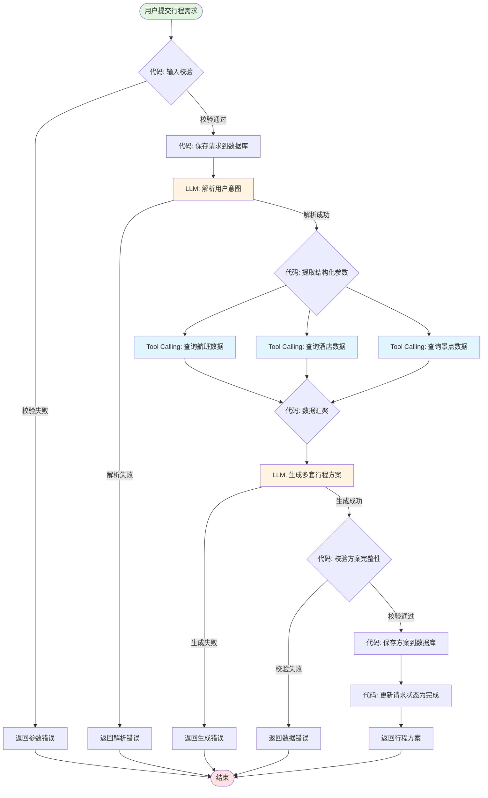
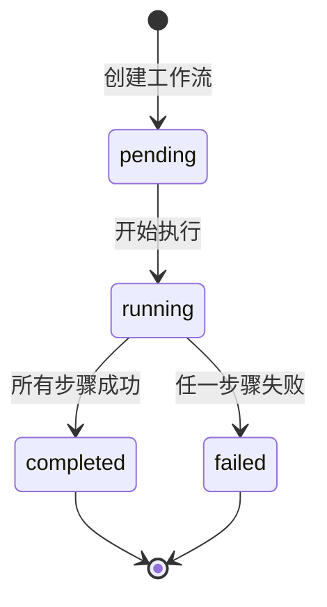
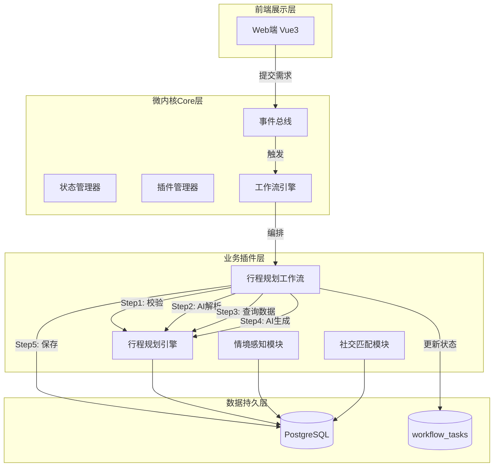

# Trailmate 伴旅 - 第7周工作流设计提交文档

> **项目名称**: Trailmate 伴旅 - AI旅行规划助手  
> **提交日期**: 2026-04-28  
> **提交人**: AI工程课程学员  

---

## 一、工作流总览

### 1.1 主业务流程

核心业务链路：**用户输入需求 → AI解析意图 → 查询基础数据 → 生成多套方案 → 保存到数据库**

本工作流串联了8个步骤，包含2个LLM节点（意图解析、方案生成）和3个Tool Calling节点（查询航班、酒店、景点数据）。

---

## 二、工作流图

### 2.1 智能行程规划工作流图



### 2.2 节点控制方式说明

| 节点 | 控制方式 | 说明 |
|------|----------|------|
| **输入校验** | 代码控制 | 确定性规则校验，无需AI判断，保证数据格式正确 |
| **保存请求** | 代码控制 | 数据库写入操作，必须可靠执行，失败可重试 |
| **解析用户意图** | LLM控制 | 需要理解自然语言的模糊性，提取目的地、天数、偏好等 |
| **查询航班/酒店/景点** | Tool Calling | 调用外部数据源，通过Supabase适配器获取基础数据 |
| **数据汇聚** | 代码控制 | 整合多个数据源结果，处理缺失数据的降级策略 |
| **生成多套方案** | LLM控制 | 需要创造性生成不同风格的行程方案（亲子版/探索版） |
| **校验方案完整性** | 代码控制 | 检查必要字段是否齐全，成本计算是否正确 |
| **保存方案** | 代码控制 | 事务性写入，确保数据一致性 |
| **更新状态** | 代码控制 | 标记请求处理完成，触发后续通知 |

### 2.3 控制方式选择理由

| 控制方式 | 使用场景 | 理由 |
|----------|----------|------|
| **代码控制** | 输入校验、数据库操作、数据汇聚、状态更新 | 确定性逻辑，需要100%可预测和可回滚，避免AI幻觉导致数据不一致 |
| **LLM控制** | 意图解析、方案生成 | 需要理解自然语言模糊性和创造性输出，AI比硬编码规则更灵活 |
| **Tool Calling** | 查询外部数据 | 标准化接口调用，代码定义调用参数，LLM决定何时调用 |

---

## 三、最小可运行实现

### 3.1 工作流运行演示

```bash
$ node src/workflow/demo.js

╔════════════════════════════════════════════════════════════╗
║     Trailmate 伴旅 - 智能行程规划工作流演示               ║
╚════════════════════════════════════════════════════════════╝

📋 用户请求:
   我想带家人去青岛玩3天，预算中等，喜欢海滩和美食

========== 工作流开始执行 ==========

[Step 1/8] 输入校验 (代码控制)
✓ 输入校验通过

[Step 2/8] 保存请求 (代码控制)
[DB] 保存请求: req_1777377123015
✓ 请求已保存到数据库

[Step 3/8] AI解析意图 (LLM控制)
✓ 意图解析结果: {
  "destination": "青岛",
  "days": 3,
  "budget": "medium",
  "travelers": { "adults": 2, "children": 1 },
  "preferences": ["亲子", "海滩", "美食"]
}

[Step 4/8] 查询基础数据 (Tool Calling)
[Tool] 查询航班数据: 青岛
[Tool] 查询酒店数据: 青岛
[Tool] 查询景点数据: 青岛
✓ 查询完成: 2个航班, 2个酒店, 4个景点

[Step 5/8] AI生成方案 (LLM控制)
✓ 生成完成: 2套方案
  - 亲子休闲版 (¥3500)
  - 探索打卡版 (¥3200)

[Step 6/8] 校验方案完整性 (代码控制)
✓ 方案校验通过

[Step 7/8] 保存方案到数据库 (代码控制)
[DB] 保存方案: 亲子休闲版
[DB] 保存方案: 探索打卡版
✓ 已保存2套方案到数据库

[Step 8/8] 完成工作流 (代码控制)
[DB] 更新请求: req_1777377123015 状态: completed
✓ 工作流完成，请求状态已更新

========== 执行日志 ==========
validate_input: 0ms
save_request: 1ms
parse_intent: 501ms
query_data: 217ms
generate_plans: 514ms
validate_plans: 0ms
save_plans: 0ms
complete: 0ms
========== 工作流执行完成，耗时: 1234ms ==========

📊 工作流执行结果:
   任务ID: task_1777377123015_4ktqj1fwf
   执行状态: completed
   总耗时: 1234ms

🎯 生成的行程方案:

   方案 1: 亲子休闲版
   描述: 节奏舒缓，适合带孩子的家庭
   标签: 亲子, 休闲, 美食
   天数: 3天
   总费用: ¥3500
   每日行程:
     第1天: 4个项目
       - flight: 北京-青岛 (08:00-10:00) ¥800
       - hotel: 海景酒店 (11:00-12:00) ¥500
       - meal: 海鲜午餐 (12:30-13:30) ¥200
       - attraction: 金沙滩 (14:00-17:00) ¥0
     第2天: 3个项目
       - attraction: 极地海洋世界 (09:00-12:00) ¥280
       - meal: 特色午餐 (12:30-13:30) ¥150
       - attraction: 栈桥 (14:00-16:00) ¥0
     第3天: 3个项目
       - attraction: 八大关 (09:00-11:00) ¥0
       - meal: 告别午餐 (11:30-12:30) ¥180
       - flight: 青岛-北京 (15:00-17:00) ¥800

   方案 2: 探索打卡版
   描述: 覆盖经典景点，适合喜欢探索的旅行者
   标签: 打卡, 摄影, 风景
   天数: 3天
   总费用: ¥3200
   每日行程:
     第1天: 4个项目
       - flight: 北京-青岛 (08:00-10:00) ¥800
       - attraction: 栈桥 (11:00-12:00) ¥0
       - meal: 午餐 (12:30-13:30) ¥120
       - attraction: 信号山公园 (14:00-16:00) ¥15
     第2天: 2个项目
       - attraction: 崂山风景区 (08:00-16:00) ¥180
       - meal: 山间午餐 (12:00-13:00) ¥100
     第3天: 4个项目
       - attraction: 五四广场 (09:00-11:00) ¥0
       - attraction: 奥帆中心 (11:30-13:00) ¥0
       - meal: 午餐 (13:30-14:30) ¥150
       - flight: 青岛-北京 (17:00-19:00) ¥800

✅ 工作流演示完成!
```

### 3.2 代码文件位置

| 文件 | 路径 | 说明 |
|------|------|------|
| 工作流引擎 | `modules/trip-tools/itinerary-generator/src/workflow/index.ts` | TypeScript实现 |
| 演示脚本 | `modules/trip-tools/itinerary-generator/src/workflow/demo.js` | 可运行演示 |
| 类型定义 | `modules/trip-tools/itinerary-generator/src/workflow/types.ts` | 类型接口 |
| 完整文档 | `docs/workflow-design.md` | 详细设计文档 |

---

## 四、Tasks 状态表设计

### 4.1 数据库表结构

```sql
CREATE TABLE workflow_tasks (
    id              UUID PRIMARY KEY DEFAULT gen_random_uuid(),
    
    -- 关联信息
    request_id      UUID NOT NULL,
    workflow_type   VARCHAR(50) NOT NULL DEFAULT 'itinerary_generation',
    
    -- 状态信息
    status          VARCHAR(20) NOT NULL DEFAULT 'pending'
        CHECK (status IN ('pending', 'running', 'completed', 'failed')),
    current_step    VARCHAR(50) NOT NULL DEFAULT 'init',
    
    -- 错误信息
    error_msg       TEXT,
    error_step      VARCHAR(50),
    
    -- 执行记录（JSONB存储详细日志）
    execution_log   JSONB DEFAULT '[]'::jsonb,
    
    -- 时间戳
    created_at      TIMESTAMPTZ DEFAULT NOW(),
    started_at      TIMESTAMPTZ,
    completed_at    TIMESTAMPTZ,
    
    -- 性能指标
    duration_ms     INTEGER
);

-- 索引
CREATE INDEX idx_workflow_tasks_request_id ON workflow_tasks(request_id);
CREATE INDEX idx_workflow_tasks_status ON workflow_tasks(status);
CREATE INDEX idx_workflow_tasks_current_step ON workflow_tasks(current_step);
CREATE INDEX idx_workflow_tasks_created_at ON workflow_tasks(created_at DESC);
```

### 4.2 字段说明

| 字段名 | 类型 | 可空 | 默认值 | 说明 |
|--------|------|------|--------|------|
| id | UUID | NO | gen_random_uuid() | 主键 |
| request_id | UUID | NO | - | 关联的请求ID |
| workflow_type | VARCHAR(50) | NO | 'itinerary_generation' | 工作流类型 |
| status | VARCHAR(20) | NO | 'pending' | 任务状态 |
| current_step | VARCHAR(50) | NO | 'init' | 当前执行步骤 |
| error_msg | TEXT | YES | NULL | 错误信息 |
| error_step | VARCHAR(50) | YES | NULL | 发生错误的步骤 |
| execution_log | JSONB | YES | [] | 执行日志 |
| created_at | TIMESTAMPTZ | NO | NOW() | 创建时间 |
| started_at | TIMESTAMPTZ | YES | NULL | 开始执行时间 |
| completed_at | TIMESTAMPTZ | YES | NULL | 完成时间 |
| duration_ms | INTEGER | YES | NULL | 执行耗时(毫秒) |

### 4.3 状态流转图



---

## 五、更新架构图

### 5.1 带工作流的系统架构图



### 5.2 工作流在架构中的位置

| 层级 | 组件 | 职责 |
|------|------|------|
| Core层 | 工作流引擎(WF) | 提供工作流编排能力，管理任务生命周期 |
| 业务层 | 行程规划工作流(IG_WF) | 实现具体业务链路，串联多个能力节点 |
| 数据层 | workflow_tasks表 | 持久化工作流执行状态，支持断点恢复和审计 |

---

## 六、工作流设计总结

### 6.1 设计原则

| 原则 | 说明 |
|------|------|
| **代码定义轨道** | 工作流步骤顺序由代码硬编码，确保可预测性 |
| **LLM负责节点判断** | 仅在需要理解/生成自然语言的节点使用LLM |
| **失败可恢复** | 每个步骤都有状态记录，失败后可从断点重试 |
| **可解释可审查** | 通过execution_log记录完整执行轨迹 |

### 6.2 关键设计决策

| 决策点 | 选择 | 理由 |
|--------|------|------|
| 工作流编排方式 | 代码编排（非AI自主） | 行程规划是确定性业务流程，代码编排更可控 |
| LLM使用节点 | 意图解析、方案生成 | 这两个节点需要理解自然语言和创造性输出 |
| 数据查询方式 | Tool Calling并行查询 | 提高效率，代码控制调用时机 |
| 状态持久化 | 独立workflow_tasks表 | 支持任务追踪、失败恢复、性能监控 |

### 6.3 与第6周契约对齐

本工作流完全遵循第6周定义的接口契约：

| 第6周契约 | 工作流实现 |
|-----------|-----------|
| `POST /api/v1/itinerary/generate` | 工作流入口，接收用户请求 |
| 请求体字段(content, preferences) | Step 1-3 解析并验证 |
| 响应体字段(plans数组) | Step 5-7 生成并保存 |
| 错误码定义 | Step 8 统一错误处理 |


---

*文档结束*
