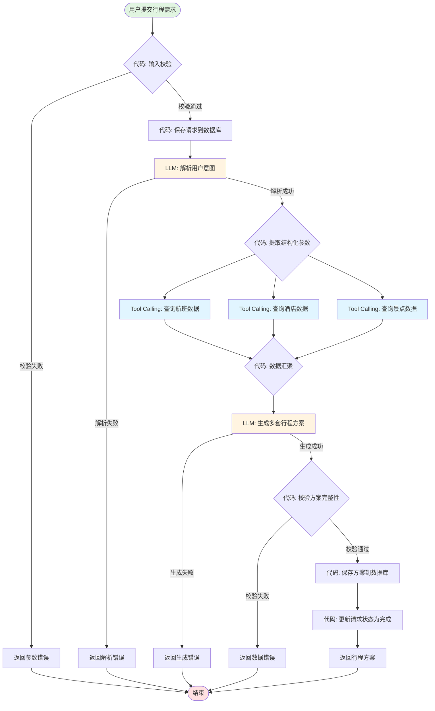
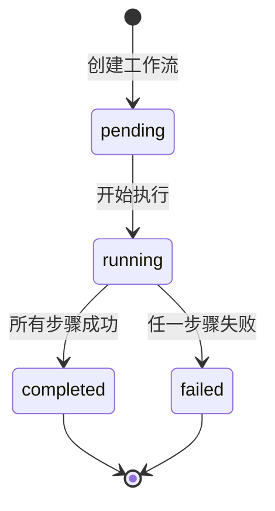
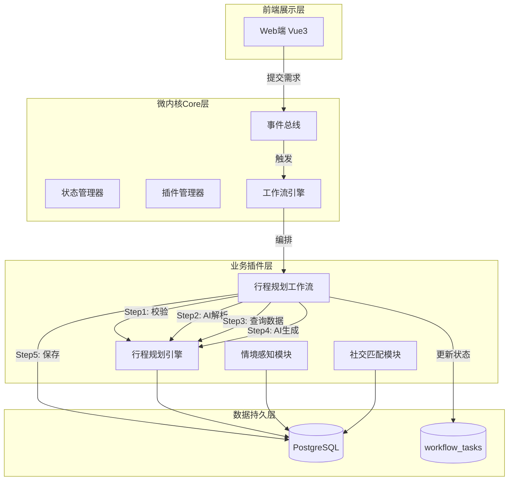

# Trailmate 伴旅 - 工作流设计文档

> **版本**: v1.0  
> **日期**: 2026-04-28  
> **目标**: 将零散接口组织成可解释、可跑通的流水线

---

## 一、工作流总览

### 1.1 主业务流程：智能行程规划工作流

核心业务链路：**用户输入需求 → AI解析意图 → 查询基础数据 → 生成多套方案 → 保存到数据库**

---

## 二、工作流图

### 2.1 智能行程规划工作流图



### 2.2 节点控制方式说明

| 节点 | 控制方式 | 说明 |
|------|----------|------|
| **输入校验** | 代码控制 | 确定性规则校验，无需AI判断，保证数据格式正确 |
| **保存请求** | 代码控制 | 数据库写入操作，必须可靠执行，失败可重试 |
| **解析用户意图** | LLM控制 | 需要理解自然语言的模糊性，提取目的地、天数、偏好等 |
| **查询航班/酒店/景点** | Tool Calling | 调用外部数据源，通过Supabase适配器获取基础数据 |
| **数据汇聚** | 代码控制 | 整合多个数据源结果，处理缺失数据的降级策略 |
| **生成多套方案** | LLM控制 | 需要创造性生成不同风格的行程方案（亲子版/探索版） |
| **校验方案完整性** | 代码控制 | 检查必要字段是否齐全，成本计算是否正确 |
| **保存方案** | 代码控制 | 事务性写入，确保数据一致性 |
| **更新状态** | 代码控制 | 标记请求处理完成，触发后续通知 |

### 2.3 控制方式选择理由

| 控制方式 | 使用场景 | 理由 |
|----------|----------|------|
| **代码控制** | 输入校验、数据库操作、数据汇聚、状态更新 | 确定性逻辑，需要100%可预测和可回滚，避免AI幻觉导致数据不一致 |
| **LLM控制** | 意图解析、方案生成 | 需要理解自然语言模糊性和创造性输出，AI比硬编码规则更灵活 |
| **Tool Calling** | 查询外部数据 | 标准化接口调用，代码定义调用参数，LLM决定何时调用 |

---

## 三、最小可运行实现

### 3.1 工作流引擎核心代码

```typescript
// modules/trip-tools/itinerary-generator/src/workflow/index.ts

import type { ItineraryRequest, ItineraryPlan } from '../types'
import type { WorkflowTask } from './types'

export enum WorkflowStep {
  INIT = 'init',
  VALIDATE_INPUT = 'validate_input',
  SAVE_REQUEST = 'save_request',
  PARSE_INTENT = 'parse_intent',
  QUERY_DATA = 'query_data',
  GENERATE_PLANS = 'generate_plans',
  VALIDATE_PLANS = 'validate_plans',
  SAVE_PLANS = 'save_plans',
  COMPLETE = 'complete',
  ERROR = 'error'
}

export enum WorkflowStatus {
  PENDING = 'pending',
  RUNNING = 'running',
  COMPLETED = 'completed',
  FAILED = 'failed'
}

export interface WorkflowContext {
  request: ItineraryRequest
  parsedIntent?: ParsedIntent
  flights?: Flight[]
  hotels?: Hotel[]
  attractions?: Attraction[]
  plans?: ItineraryPlan[]
  error?: string
}

export interface ParsedIntent {
  destination: string
  days: number
  budget?: 'low' | 'medium' | 'high'
  travelers?: {
    adults: number
    children: number
  }
  preferences?: string[]
}

export class ItineraryWorkflow {
  private task: WorkflowTask
  private context: WorkflowContext

  constructor(request: ItineraryRequest) {
    this.task = {
      id: generateTaskId(),
      status: WorkflowStatus.PENDING,
      currentStep: WorkflowStep.INIT,
      requestId: request.id,
      createdAt: Date.now(),
      updatedAt: Date.now()
    }
    this.context = { request }
  }

  async execute(): Promise<ItineraryPlan[]> {
    try {
      this.updateStatus(WorkflowStatus.RUNNING)
      
      // Step 1: 输入校验（代码控制）
      await this.stepValidateInput()
      
      // Step 2: 保存请求（代码控制）
      await this.stepSaveRequest()
      
      // Step 3: AI解析意图（LLM控制）
      await this.stepParseIntent()
      
      // Step 4: 查询基础数据（Tool Calling）
      await this.stepQueryData()
      
      // Step 5: AI生成方案（LLM控制）
      await this.stepGeneratePlans()
      
      // Step 6: 校验方案（代码控制）
      await this.stepValidatePlans()
      
      // Step 7: 保存方案（代码控制）
      await this.stepSavePlans()
      
      // Step 8: 完成
      await this.stepComplete()
      
      return this.context.plans!
    } catch (error) {
      await this.stepError(error as Error)
      throw error
    }
  }

  // Step 1: 输入校验（代码控制）
  private async stepValidateInput(): Promise<void> {
    this.updateStep(WorkflowStep.VALIDATE_INPUT)
    
    const { content } = this.context.request
    
    // 确定性校验规则
    if (!content || content.trim().length < 5) {
      throw new Error('行程描述至少需要5个字符')
    }
    
    if (content.length > 2000) {
      throw new Error('行程描述不能超过2000个字符')
    }
  }

  // Step 2: 保存请求（代码控制）
  private async stepSaveRequest(): Promise<void> {
    this.updateStep(WorkflowStep.SAVE_REQUEST)
    
    await db.itineraryRequests.create({
      id: this.context.request.id,
      content: this.context.request.content,
      imageUrl: this.context.request.imageUrl,
      status: 'processing',
      createdAt: new Date()
    })
  }

  // Step 3: AI解析意图（LLM控制）
  private async stepParseIntent(): Promise<void> {
    this.updateStep(WorkflowStep.PARSE_INTENT)
    
    const prompt = `
请解析用户的行程需求，提取以下结构化信息：
用户输入："${this.context.request.content}"

请返回JSON格式：
{
  "destination": "目的地城市",
  "days": 天数(数字),
  "budget": "预算级别: low/medium/high",
  "travelers": {
    "adults": 成人数量,
    "children": 儿童数量
  },
  "preferences": ["偏好标签1", "偏好标签2"]
}
`
    
    const response = await callLLM(prompt)
    this.context.parsedIntent = JSON.parse(response) as ParsedIntent
  }

  // Step 4: 查询基础数据（Tool Calling）
  private async stepQueryData(): Promise<void> {
    this.updateStep(WorkflowStep.QUERY_DATA)
    
    const { destination } = this.context.parsedIntent!
    
    // 并行查询多个数据源
    const [flights, hotels, attractions] = await Promise.all([
      this.queryFlights(destination),
      this.queryHotels(destination),
      this.queryAttractions(destination)
    ])
    
    this.context.flights = flights
    this.context.hotels = hotels
    this.context.attractions = attractions
  }

  private async queryFlights(city: string): Promise<Flight[]> {
    // Tool Calling: 调用Supabase查询航班
    return await flightService.query({ arrCity: city })
  }

  private async queryHotels(city: string): Promise<Hotel[]> {
    // Tool Calling: 调用Supabase查询酒店
    return await hotelService.query({ city })
  }

  private async queryAttractions(city: string): Promise<Attraction[]> {
    // Tool Calling: 调用Supabase查询景点
    return await attractionService.query({ city })
  }

  // Step 5: AI生成方案（LLM控制）
  private async stepGeneratePlans(): Promise<void> {
    this.updateStep(WorkflowStep.GENERATE_PLANS)
    
    const { parsedIntent, flights, hotels, attractions } = this.context
    
    const prompt = `
基于以下信息生成2套不同风格的行程方案：

用户需求：
- 目的地：${parsedIntent!.destination}
- 天数：${parsedIntent!.days}天
- 预算：${parsedIntent!.budget || 'medium'}
- 偏好：${parsedIntent!.preferences?.join(', ') || '无'}

可用资源：
- 航班：${flights?.length || 0}个选项
- 酒店：${hotels?.length || 0}个选项  
- 景点：${attractions?.length || 0}个选项

请生成JSON格式（包含2套方案）：
{
  "plans": [
    {
      "name": "方案名称（如亲子休闲版）",
      "description": "方案描述",
      "tags": ["标签1", "标签2"],
      "totalDays": 天数,
      "totalCost": 总费用,
      "days": [
        {
          "day": 1,
          "items": [
            {
              "type": "flight/hotel/attraction/meal/transport",
              "name": "项目名称",
              "startTime": "08:00",
              "endTime": "10:00",
              "cost": 费用
            }
          ]
        }
      ]
    }
  ]
}
`
    
    const response = await callLLM(prompt)
    const result = JSON.parse(response)
    this.context.plans = result.plans
  }

  // Step 6: 校验方案（代码控制）
  private async stepValidatePlans(): Promise<void> {
    this.updateStep(WorkflowStep.VALIDATE_PLANS)
    
    const { plans, parsedIntent } = this.context
    
    if (!plans || plans.length === 0) {
      throw new Error('未生成任何行程方案')
    }
    
    for (const plan of plans) {
      // 校验必要字段
      if (!plan.name || !plan.description) {
        throw new Error('方案缺少名称或描述')
      }
      
      // 校验天数匹配
      if (plan.totalDays !== parsedIntent!.days) {
        throw new Error(`方案天数不匹配：期望${parsedIntent!.days}天，实际${plan.totalDays}天`)
      }
      
      // 校验成本为正数
      if (plan.totalCost <= 0) {
        throw new Error('方案总成本必须大于0')
      }
    }
  }

  // Step 7: 保存方案（代码控制）
  private async stepSavePlans(): Promise<void> {
    this.updateStep(WorkflowStep.SAVE_PLANS)
    
    for (const plan of this.context.plans!) {
      await db.itineraryPlans.create({
        ...plan,
        requestId: this.context.request.id,
        createdAt: new Date()
      })
    }
  }

  // Step 8: 完成
  private async stepComplete(): Promise<void> {
    this.updateStep(WorkflowStep.COMPLETE)
    this.updateStatus(WorkflowStatus.COMPLETED)
    
    await db.itineraryRequests.update({
      where: { id: this.context.request.id },
      data: { status: 'completed', completedAt: new Date() }
    })
  }

  // 错误处理
  private async stepError(error: Error): Promise<void> {
    this.updateStep(WorkflowStep.ERROR)
    this.updateStatus(WorkflowStatus.FAILED)
    this.context.error = error.message
    
    await db.itineraryRequests.update({
      where: { id: this.context.request.id },
      data: { status: 'failed', errorMsg: error.message }
    })
  }

  private updateStep(step: WorkflowStep): void {
    this.task.currentStep = step
    this.task.updatedAt = Date.now()
  }

  private updateStatus(status: WorkflowStatus): void {
    this.task.status = status
    this.task.updatedAt = Date.now()
  }

  getTask(): WorkflowTask {
    return this.task
  }
}
```

### 3.2 工作流类型定义

```typescript
// modules/trip-tools/itinerary-generator/src/workflow/types.ts

export interface WorkflowTask {
  id: string
  status: WorkflowStatus
  currentStep: WorkflowStep
  requestId: string
  errorMsg?: string
  createdAt: number
  updatedAt: number
}

export enum WorkflowStatus {
  PENDING = 'pending',
  RUNNING = 'running',
  COMPLETED = 'completed',
  FAILED = 'failed'
}

export enum WorkflowStep {
  INIT = 'init',
  VALIDATE_INPUT = 'validate_input',
  SAVE_REQUEST = 'save_request',
  PARSE_INTENT = 'parse_intent',
  QUERY_DATA = 'query_data',
  GENERATE_PLANS = 'generate_plans',
  VALIDATE_PLANS = 'validate_plans',
  SAVE_PLANS = 'save_plans',
  COMPLETE = 'complete',
  ERROR = 'error'
}
```

---

## 四、Tasks 状态表设计

### 4.1 数据库表结构

```sql
CREATE TABLE workflow_tasks (
    id              UUID PRIMARY KEY DEFAULT gen_random_uuid(),
    
    -- 关联信息
    request_id      UUID NOT NULL,
    workflow_type   VARCHAR(50) NOT NULL DEFAULT 'itinerary_generation',
    
    -- 状态信息
    status          VARCHAR(20) NOT NULL DEFAULT 'pending'
        CHECK (status IN ('pending', 'running', 'completed', 'failed')),
    current_step    VARCHAR(50) NOT NULL DEFAULT 'init',
    
    -- 错误信息
    error_msg       TEXT,
    error_step      VARCHAR(50),
    
    -- 执行记录（JSONB存储详细日志）
    execution_log   JSONB DEFAULT '[]'::jsonb,
    
    -- 时间戳
    created_at      TIMESTAMPTZ DEFAULT NOW(),
    started_at      TIMESTAMPTZ,
    completed_at    TIMESTAMPTZ,
    
    -- 性能指标
    duration_ms     INTEGER
);

-- 索引
CREATE INDEX idx_workflow_tasks_request_id ON workflow_tasks(request_id);
CREATE INDEX idx_workflow_tasks_status ON workflow_tasks(status);
CREATE INDEX idx_workflow_tasks_current_step ON workflow_tasks(current_step);
CREATE INDEX idx_workflow_tasks_created_at ON workflow_tasks(created_at DESC);

-- 注释
COMMENT ON TABLE workflow_tasks IS '工作流任务状态表，记录每个工作流的执行状态';
COMMENT ON COLUMN workflow_tasks.execution_log IS '执行日志数组，记录每个步骤的开始/结束时间';
```

### 4.2 字段说明

| 字段名 | 类型 | 可空 | 默认值 | 说明 |
|--------|------|------|--------|------|
| id | UUID | NO | gen_random_uuid() | 主键 |
| request_id | UUID | NO | - | 关联的请求ID |
| workflow_type | VARCHAR(50) | NO | 'itinerary_generation' | 工作流类型 |
| status | VARCHAR(20) | NO | 'pending' | 任务状态 |
| current_step | VARCHAR(50) | NO | 'init' | 当前执行步骤 |
| error_msg | TEXT | YES | NULL | 错误信息 |
| error_step | VARCHAR(50) | YES | NULL | 发生错误的步骤 |
| execution_log | JSONB | YES | [] | 执行日志 |
| created_at | TIMESTAMPTZ | NO | NOW() | 创建时间 |
| started_at | TIMESTAMPTZ | YES | NULL | 开始执行时间 |
| completed_at | TIMESTAMPTZ | YES | NULL | 完成时间 |
| duration_ms | INTEGER | YES | NULL | 执行耗时(毫秒) |

### 4.3 状态流转图



---

## 五、更新架构图

### 5.1 带工作流的系统架构图



### 5.2 工作流在架构中的位置

| 层级 | 组件 | 职责 |
|------|------|------|
| Core层 | 工作流引擎(WF) | 提供工作流编排能力，管理任务生命周期 |
| 业务层 | 行程规划工作流(IG_WF) | 实现具体业务链路，串联多个能力节点 |
| 数据层 | workflow_tasks表 | 持久化工作流执行状态，支持断点恢复和审计 |

---

## 六、工作流设计总结

### 6.1 设计原则

| 原则 | 说明 |
|------|------|
| **代码定义轨道** | 工作流步骤顺序由代码硬编码，确保可预测性 |
| **LLM负责节点判断** | 仅在需要理解/生成自然语言的节点使用LLM |
| **失败可恢复** | 每个步骤都有状态记录，失败后可从断点重试 |
| **可解释可审查** | 通过execution_log记录完整执行轨迹 |

### 6.2 关键设计决策

| 决策点 | 选择 | 理由 |
|--------|------|------|
| 工作流编排方式 | 代码编排（非AI自主） | 行程规划是确定性业务流程，代码编排更可控 |
| LLM使用节点 | 意图解析、方案生成 | 这两个节点需要理解自然语言和创造性输出 |
| 数据查询方式 | Tool Calling并行查询 | 提高效率，代码控制调用时机 |
| 状态持久化 | 独立workflow_tasks表 | 支持任务追踪、失败恢复、性能监控 |

---

*文档结束*
